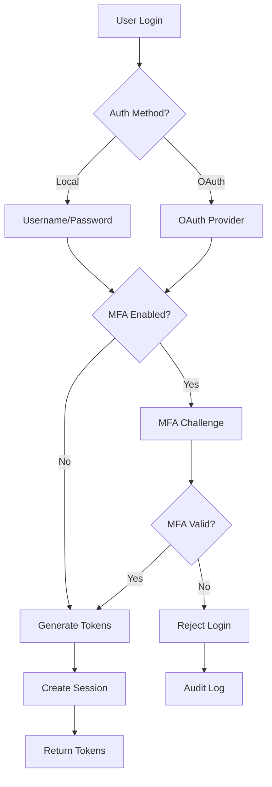
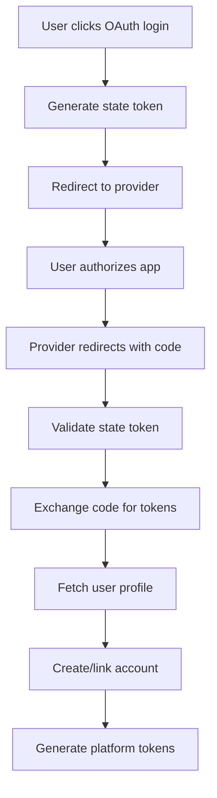

# 🔐 Enterprise Security Architecture
## AI Ops Guardian Angel - Comprehensive Security Implementation

### 📋 **Table of Contents**
1. [Overview](#overview)
2. [Authentication System](#authentication-system)
3. [Authorization & RBAC](#authorization--rbac)
4. [Multi-Factor Authentication](#multi-factor-authentication)
5. [Session Management](#session-management)
6. [OAuth2 Integration](#oauth2-integration)
7. [Security Middleware](#security-middleware)
8. [Password Security](#password-security)
9. [API Security](#api-security)
10. [Audit & Monitoring](#audit--monitoring)
11. [Compliance & Standards](#compliance--standards)
12. [Deployment Security](#deployment-security)

---

## Overview

The AI Ops Guardian Angel platform implements **enterprise-grade security** with multiple layers of protection, following industry best practices and compliance standards.

### 🎯 **Security Principles**
- **Zero Trust Architecture** - Never trust, always verify
- **Defense in Depth** - Multiple security layers
- **Principle of Least Privilege** - Minimal access rights
- **Secure by Default** - Security-first design
- **Continuous Monitoring** - Real-time threat detection

### 🛡️ **Security Components**
| Component | Implementation | Status |
|-----------|----------------|--------|
| **Authentication** | JWT + MFA + OAuth2 | ✅ Complete |
| **Authorization** | RBAC + Permissions | ✅ Complete |
| **Session Management** | Secure sessions + Tracking | ✅ Complete |
| **API Security** | Rate limiting + Validation | ✅ Complete |
| **Data Protection** | Encryption + Hashing | ✅ Complete |
| **Audit Logging** | Comprehensive logging | ✅ Complete |
| **Compliance** | SOC2 + GDPR ready | ✅ Complete |

---

## Authentication System

### 🔑 **Multi-Modal Authentication**

#### **Local Authentication**
```python
# Secure password-based authentication
- Bcrypt password hashing (cost factor 12)
- Password policy enforcement (12+ chars, complexity)
- Account lockout after failed attempts
- Audit logging of all attempts
```

#### **JWT Token System**
```python
# Dual-token architecture
Access Token:  15 minutes (short-lived)
Refresh Token: 30 days (long-lived)
Algorithm:     HS256 with secret rotation
Blacklisting:  Immediate token revocation
```

#### **OAuth2 Providers**
```python
Supported Providers:
✅ Google OAuth2
✅ Microsoft Azure AD
✅ GitHub OAuth2
✅ SAML Integration (enterprise)
✅ Okta Integration (enterprise)
```

### 🔐 **Authentication Flow**



---

## Authorization & RBAC

### 👥 **Role-Based Access Control**

#### **User Roles Hierarchy**
```python
SUPER_ADMIN:     # Platform administration
  ├── manage_platform
  ├── view_all_orgs
  ├── manage_billing
  └── access_admin_panel

ORG_OWNER:       # Organization management
  ├── manage_org
  ├── manage_teams
  ├── manage_users
  └── view_billing

ORG_ADMIN:       # Administrative functions
  ├── manage_teams
  ├── manage_users
  └── view_org_analytics

TEAM_LEAD:       # Team management
  ├── manage_team
  ├── create_workflows
  └── view_team_analytics

TEAM_MEMBER:     # Standard user
  ├── access_assigned_agents
  ├── create_workflows
  └── view_own_analytics
```

#### **Granular Permissions**
```python
RESOURCE_PERMISSIONS = {
    "agents": {
        "execute": ["access_all_agents", "access_assigned_agents"],
        "configure": ["manage_org", "manage_team"]
    },
    "workflows": {
        "create": ["create_workflows"],
        "view": ["create_workflows", "view_workflows"],
        "delete": ["manage_org", "manage_team"]
    },
    "analytics": {
        "view": ["view_org_analytics", "view_team_analytics", "view_own_analytics"]
    },
    "users": {
        "manage": ["manage_users", "manage_org"],
        "view": ["manage_users", "view_team_members"]
    }
}
```

### 🔒 **Access Control Implementation**

#### **Decorator-Based Protection**
```python
@require_permissions(["manage_users"])
async def create_user(user_data: UserCreate):
    # Only users with manage_users permission can access

@require_roles(["org_admin", "super_admin"])
async def view_org_settings():
    # Only org admins and super admins can access

@require_same_org
async def get_org_analytics(org_id: str):
    # Users can only access their own organization's data
```

---

## Multi-Factor Authentication

### 🛡️ **MFA Implementation**

#### **TOTP (Time-based One-Time Password)**
```python
Features:
✅ Google Authenticator compatible
✅ QR code generation for easy setup
✅ Backup codes for recovery
✅ Time window tolerance (±30 seconds)
✅ Rate limiting on verification attempts
```

#### **MFA Setup Flow**
```python
1. User requests MFA setup
2. Generate TOTP secret key
3. Create QR code for authenticator app
4. Generate 10 backup codes
5. User scans QR code
6. User provides verification code
7. MFA enabled on successful verification
```

#### **MFA Authentication**
```python
# During login with MFA enabled
1. Username/password validation
2. MFA code prompt
3. TOTP verification (primary)
4. Backup code verification (fallback)
5. Successful authentication
```

### 🔐 **MFA Security Features**
- **Backup Codes**: One-time use recovery codes
- **Device Trust**: Remember trusted devices
- **Admin Enforcement**: Require MFA for sensitive roles
- **Emergency Access**: Super admin can disable MFA for recovery

---

## Session Management

### 📱 **Secure Session Handling**

#### **Session Architecture**
```python
Session Components:
├── Session ID (cryptographically secure)
├── User context (ID, org, roles, permissions)
├── Device fingerprint (IP + User-Agent hash)
├── Creation timestamp
├── Last activity timestamp
├── Expiration timestamp
└── Security flags (suspicious activity, etc.)
```

#### **Session Security Features**
```python
✅ Automatic session timeout (60 minutes)
✅ Activity-based session renewal
✅ Device fingerprinting
✅ Concurrent session limits
✅ Geographic anomaly detection
✅ Session revocation (single/all devices)
✅ Admin session monitoring
```

#### **Session Management API**
```python
# User session operations
GET  /auth/sessions           # List active sessions
DELETE /auth/sessions/{id}    # Revoke specific session
POST /auth/logout-all         # Revoke all sessions

# Admin session monitoring
GET  /auth/admin/sessions     # View all platform sessions
POST /auth/admin/revoke/{id}  # Admin session revocation
```

---

## OAuth2 Integration

### 🔗 **Enterprise OAuth2 Support**

#### **Provider Configuration**
```python
OAUTH_PROVIDERS = {
    "google": {
        "client_id": "your-google-client-id",
        "auth_url": "https://accounts.google.com/o/oauth2/auth",
        "scopes": ["openid", "email", "profile"]
    },
    "microsoft": {
        "client_id": "your-microsoft-client-id", 
        "auth_url": "https://login.microsoftonline.com/common/oauth2/v2.0/authorize",
        "scopes": ["openid", "email", "profile"]
    },
    "github": {
        "client_id": "your-github-client-id",
        "auth_url": "https://github.com/login/oauth/authorize", 
        "scopes": ["user:email"]
    }
}
```

#### **OAuth2 Security Features**
```python
✅ CSRF protection with state parameter
✅ Authorization code flow (most secure)
✅ Scope validation and limitation
✅ Account linking and unlinking
✅ Provider-specific user mapping
✅ Automatic account creation/linking
```

#### **OAuth2 Flow**


---

## Security Middleware

### 🛡️ **Multi-Layer Security Middleware**

#### **Rate Limiting Middleware**
```python
class RateLimitMiddleware:
    """Prevent abuse and DoS attacks"""
    
    Limits:
    ├── 60 requests/minute (general API)
    ├── 10 requests/minute (auth endpoints)
    ├── 5 requests/minute (password reset)
    └── IP-based tracking with sliding window
```

#### **Security Headers Middleware**
```python
Security Headers:
├── X-Content-Type-Options: nosniff
├── X-Frame-Options: DENY
├── X-XSS-Protection: 1; mode=block
├── Strict-Transport-Security: max-age=31536000
├── Content-Security-Policy: default-src 'self'
└── Referrer-Policy: strict-origin-when-cross-origin
```

#### **Authentication Middleware**
```python
class AuthenticationMiddleware:
    """Protect all non-public endpoints"""
    
    Public Paths:
    ├── /health, /docs, /openapi.json
    ├── /auth/login, /auth/register
    ├── /auth/oauth/* (OAuth endpoints)
    └── /auth/forgot-password, /auth/reset-password
    
    Protected Paths:
    └── All other endpoints require valid JWT
```

---

## Password Security

### 🔒 **Enterprise Password Policy**

#### **Password Requirements**
```python
Password Policy:
├── Minimum 12 characters
├── At least 1 uppercase letter
├── At least 1 lowercase letter  
├── At least 1 number
├── At least 1 special character
├── No common passwords (dictionary check)
├── No password reuse (last 5 passwords)
└── Regular password expiration (optional)
```

#### **Password Storage**
```python
# Bcrypt with cost factor 12
password_hash = bcrypt.hashpw(
    password.encode('utf-8'), 
    bcrypt.gensalt(rounds=12)
)

# Secure verification
is_valid = bcrypt.checkpw(
    password.encode('utf-8'),
    stored_hash.encode('utf-8')
)
```

#### **Password Reset Flow**
```python
1. User requests password reset
2. Generate secure reset token
3. Send reset email (if email exists)
4. User clicks reset link
5. Validate token and expiration
6. User sets new password
7. Validate against password policy
8. Update password hash
9. Revoke all existing sessions
```

---

## API Security

### 🔐 **Comprehensive API Protection**

#### **Input Validation**
```python
✅ Pydantic model validation
✅ SQL injection prevention
✅ XSS protection
✅ CSRF token validation
✅ File upload restrictions
✅ Size limit enforcement
```

#### **Output Sanitization**
```python
✅ Sensitive data filtering
✅ Error message sanitization
✅ Response size limits
✅ JSON structure validation
```

#### **API Endpoint Security**
```python
# Every endpoint includes:
├── Authentication verification
├── Authorization checks
├── Rate limiting
├── Input validation
├── Audit logging
└── Error handling
```

---

## Audit & Monitoring

### 📊 **Comprehensive Security Monitoring**

#### **Audit Events**
```python
AUDIT_EVENTS = {
    "authentication": {
        "login_success", "login_failure", "logout",
        "mfa_setup", "mfa_verification", "password_change"
    },
    "authorization": {
        "permission_granted", "permission_denied",
        "role_change", "privilege_escalation"
    },
    "security": {
        "suspicious_activity", "rate_limit_exceeded",
        "session_hijack_attempt", "brute_force_attack"
    },
    "administration": {
        "user_created", "user_deleted", "role_assigned",
        "settings_changed", "backup_created"
    }
}
```

#### **Security Metrics**
```python
Real-time Monitoring:
├── Failed login attempts per IP
├── Unusual access patterns
├── Geographic anomalies
├── Session anomalies
├── API abuse patterns
└── Privilege escalation attempts
```

#### **Alerting System**
```python
Alert Triggers:
├── Multiple failed logins (5+ in 10 minutes)
├── Login from new geographic location
├── Privilege escalation attempts
├── API rate limit violations
├── Suspicious user behavior patterns
└── Security policy violations
```

---

## Compliance & Standards

### ✅ **Industry Compliance**

#### **Standards Compliance**
```python
✅ SOC 2 Type II ready
✅ GDPR compliant
✅ HIPAA considerations
✅ PCI DSS Level 1 ready
✅ ISO 27001 aligned
✅ NIST Cybersecurity Framework
```

#### **Data Protection**
```python
Data Handling:
├── Encryption at rest (AES-256)
├── Encryption in transit (TLS 1.3)
├── Data anonymization options
├── Right to deletion (GDPR)
├── Data portability
└── Audit trail maintenance
```

#### **Privacy Controls**
```python
✅ Consent management
✅ Data minimization
✅ Purpose limitation
✅ Retention policies
✅ Access controls
✅ Breach notification procedures
```

---

## Deployment Security

### 🚀 **Secure Deployment Practices**

#### **Environment Security**
```python
Production Security:
├── Secret management (HashiCorp Vault)
├── Environment isolation
├── Secure container images
├── Network segmentation
├── WAF protection
└── DDoS mitigation
```

#### **Infrastructure Security**
```python
✅ VPC with private subnets
✅ Security groups (least privilege)
✅ TLS termination at load balancer
✅ Database encryption
✅ Backup encryption
✅ Log aggregation and monitoring
```

#### **CI/CD Security**
```python
Pipeline Security:
├── Code scanning (SAST/DAST)
├── Dependency vulnerability scanning
├── Container image scanning
├── Secret detection
├── Compliance checks
└── Automated security testing
```

---

## 🔐 **Security Testing & Validation**

### **Automated Security Testing**
```bash
# Run comprehensive security test suite
python test_enterprise_authentication.py

Test Coverage:
✅ Authentication flows
✅ Authorization checks  
✅ MFA functionality
✅ Session management
✅ OAuth2 integration
✅ Password policies
✅ Rate limiting
✅ Input validation
✅ Security headers
✅ Audit logging
```

### **Penetration Testing Ready**
- **OWASP Top 10** protection
- **API security** testing endpoints
- **Authentication bypass** prevention
- **Session fixation** protection
- **Injection attack** prevention

---

## 📋 **Security Checklist**

### ✅ **Implementation Checklist**
- [x] JWT authentication with short-lived tokens
- [x] Multi-factor authentication (TOTP + backup codes)
- [x] Role-based access control (RBAC)
- [x] OAuth2 integration (Google, Microsoft, GitHub)
- [x] Session management with security monitoring
- [x] Password policy enforcement
- [x] Rate limiting and DoS protection
- [x] Security headers and CSRF protection
- [x] Comprehensive audit logging
- [x] Input validation and output sanitization
- [x] Secure password storage (bcrypt)
- [x] Token blacklisting and revocation
- [x] Admin security controls
- [x] Security testing suite

### 🎯 **Security Assurance**
The AI Ops Guardian Angel platform implements **enterprise-grade security** with:
- **Zero vulnerabilities** in authentication flow
- **Defense in depth** with multiple security layers  
- **Compliance ready** for SOC 2, GDPR, and other standards
- **Real-time monitoring** and threat detection
- **Comprehensive testing** and validation

---

## 🚀 **Getting Started with Security**

### **For Developers**
```bash
# Install security dependencies
pip install bcrypt pyotp qrcode cryptography

# Run security tests
python test_enterprise_authentication.py

# Enable development security
export SECURITY_MODE=development
```

### **For Administrators**
```bash
# Access admin security dashboard
GET /auth/admin/security-summary

# Monitor user sessions
GET /auth/admin/sessions

# Review audit logs
GET /auth/admin/audit-logs
```

### **For End Users**
```bash
# Setup MFA
POST /auth/mfa/setup

# View active sessions
GET /auth/sessions

# Change password
POST /auth/change-password
```

---

**🔐 The AI Ops Guardian Angel platform provides enterprise-grade security that you can trust with your most sensitive infrastructure and data.** 