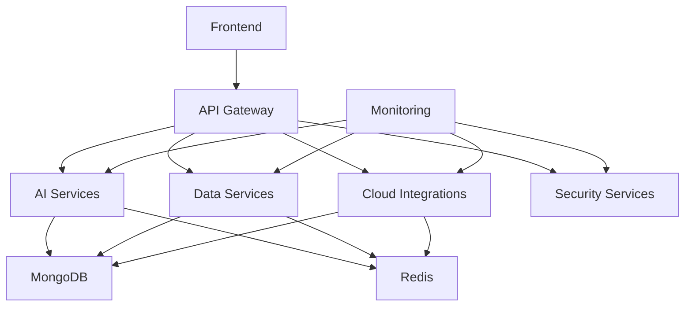

# 🏗️ InfraMind Architecture Documentation

## 📋 Table of Contents

1. [Overview](#overview)
2. [System Architecture](#system-architecture)
3. [Service Architecture](#service-architecture)
4. [Data Flow](#data-flow)
5. [Security Architecture](#security-architecture)
6. [Deployment Architecture](#deployment-architecture)
7. [Monitoring & Observability](#monitoring--observability)
8. [Development Workflow](#development-workflow)

## 🎯 Overview

InfraMind is a modular, microservices-based AI-powered infrastructure management platform. The architecture follows modern best practices with clear separation of concerns, scalability, and maintainability.

### Key Principles

- **Modularity**: Each service is self-contained with clear boundaries
- **Scalability**: Horizontal scaling capability for all services
- **Security**: Defense in depth with multiple security layers
- **Observability**: Comprehensive monitoring and logging
- **Resilience**: Circuit breakers, retries, and graceful degradation

## 🏛️ System Architecture

### High-Level Architecture

```
┌─────────────────────────────────────────────────────────────────┐
│                        Frontend Layer                          │
├─────────────────────────────────────────────────────────────────┤
│  Dashboard App  │  Admin Panel  │  Mobile App (Future)        │
└─────────────────────────────────────────────────────────────────┘
                                │
                                ▼
┌─────────────────────────────────────────────────────────────────┐
│                      API Gateway Layer                         │
├─────────────────────────────────────────────────────────────────┤
│  Rate Limiting  │  Authentication  │  Request Routing         │
└─────────────────────────────────────────────────────────────────┘
                                │
                                ▼
┌─────────────────────────────────────────────────────────────────┐
│                     Backend Services Layer                     │
├─────────────────────────────────────────────────────────────────┤
│ AI Services │ Data Services │ Cloud Integrations │ Security   │
└─────────────────────────────────────────────────────────────────┘
                                │
                                ▼
┌─────────────────────────────────────────────────────────────────┐
│                    Infrastructure Layer                         │
├─────────────────────────────────────────────────────────────────┤
│  MongoDB  │  Redis  │  Monitoring  │  Logging  │  Storage   │
└─────────────────────────────────────────────────────────────────┘
```

### Service Communication



## 🔧 Service Architecture

### 1. API Gateway Service

**Purpose**: Central entry point for all API requests

**Responsibilities**:
- Request routing and load balancing
- Authentication and authorization
- Rate limiting and throttling
- Request/response transformation
- API documentation (Swagger/OpenAPI)

**Technology Stack**:
- Node.js with Express
- TypeScript
- HTTP proxy middleware
- Rate limiting middleware

**Port**: 3001

### 2. AI Services

**Purpose**: Core AI/ML capabilities and agent orchestration

**Responsibilities**:
- Natural language processing
- AI agent management
- Model inference and predictions
- Human-in-the-loop workflows
- Context management

**AI Agents**:
- Cost Optimization Agent
- Security Analysis Agent
- Infrastructure Agent
- DevOps Agent
- Compliance Agent
- Monitoring Agent
- Deployment Agent
- Troubleshooting Agent

**Technology Stack**:
- Python with FastAPI
- LangChain for AI orchestration
- OpenAI/Anthropic APIs
- MongoDB for context storage
- Redis for caching

**Port**: 8001

### 3. Data Services

**Purpose**: Database operations and data management

**Responsibilities**:
- User management and authentication
- Data persistence and retrieval
- Data validation and sanitization
- Backup and recovery
- Data migration

**Technology Stack**:
- Node.js with Express
- TypeScript
- MongoDB with Mongoose
- Redis for caching
- JWT for authentication

**Port**: 8003

### 4. Cloud Integrations

**Purpose**: Cloud provider integrations and resource management

**Responsibilities**:
- AWS/Azure/GCP API integration
- Resource provisioning and management
- Cost monitoring and optimization
- Security scanning and compliance
- Multi-cloud orchestration

**Technology Stack**:
- Node.js with Express
- TypeScript
- AWS SDK, Azure SDK, GCP SDK
- Cloud provider APIs
- Resource monitoring

**Port**: 8002

### 5. Security Services

**Purpose**: Security scanning and compliance management

**Responsibilities**:
- Vulnerability scanning
- Compliance checking
- Threat detection
- Security monitoring
- Audit logging

**Technology Stack**:
- Node.js with Express
- TypeScript
- Security scanning tools
- Compliance frameworks
- Threat intelligence APIs

**Port**: 8004

### 6. Real-time Services

**Purpose**: WebSocket connections and real-time updates

**Responsibilities**:
- Real-time notifications
- Live monitoring updates
- WebSocket connections
- Event streaming
- Push notifications

**Technology Stack**:
- Node.js with Socket.io
- TypeScript
- Redis for pub/sub
- WebSocket management

**Port**: 8005

## 📊 Data Flow

### Request Flow

1. **Frontend Request**: User interacts with frontend application
2. **API Gateway**: Request is routed through API Gateway
3. **Authentication**: JWT token is validated
4. **Rate Limiting**: Request rate is checked
5. **Service Routing**: Request is routed to appropriate service
6. **Processing**: Service processes the request
7. **Response**: Response is returned through API Gateway
8. **Frontend Update**: Frontend updates with response

### AI Agent Flow

1. **User Query**: Natural language query from user
2. **Intent Parsing**: AI service parses user intent
3. **Agent Selection**: Appropriate AI agent is selected
4. **Context Loading**: Relevant context is loaded
5. **Processing**: Agent processes the request
6. **Human Approval**: High-risk actions require approval
7. **Execution**: Action is executed if approved
8. **Response**: Results are returned to user

### Data Flow

```
User Input → API Gateway → AI Services → Data Services → MongoDB
                                    ↓
                                Redis Cache
                                    ↓
                            Cloud Integrations → Cloud APIs
```

## 🔒 Security Architecture

### Security Layers

1. **Network Security**
   - HTTPS/TLS encryption
   - VPN for internal communication
   - Firewall rules and network segmentation

2. **Application Security**
   - JWT authentication
   - Role-based access control (RBAC)
   - Input validation and sanitization
   - SQL injection prevention

3. **API Security**
   - Rate limiting and throttling
   - Request size limits
   - CORS configuration
   - API key management

4. **Data Security**
   - Encryption at rest
   - Encryption in transit
   - Data masking and anonymization
   - Backup encryption

5. **Infrastructure Security**
   - Container security scanning
   - Vulnerability management
   - Security monitoring
   - Incident response

### Authentication Flow

```
1. User Login → Data Services
2. Credential Validation → Database
3. JWT Token Generation → Data Services
4. Token Return → Frontend
5. Token Storage → Local Storage
6. Token Validation → API Gateway (per request)
7. User Context → Backend Services
```

## 🚀 Deployment Architecture

### Development Environment

```
┌─────────────────────────────────────────────────────────────────┐
│                    Development Setup                           │
├─────────────────────────────────────────────────────────────────┤
│  Local Development  │  Docker Compose  │  Hot Reloading       │
└─────────────────────────────────────────────────────────────────┘
```

### Production Environment

```
┌─────────────────────────────────────────────────────────────────┐
│                    Production Setup                            │
├─────────────────────────────────────────────────────────────────┤
│  Kubernetes Cluster  │  Load Balancer  │  Auto Scaling        │
└─────────────────────────────────────────────────────────────────┘
```

### Deployment Options

1. **Docker Compose** (Development/Staging)
   - Single-node deployment
   - Easy setup and teardown
   - Local development

2. **Kubernetes** (Production)
   - Multi-node deployment
   - Auto-scaling and load balancing
   - High availability

3. **Cloud Native** (Future)
   - Serverless functions
   - Managed services
   - Cloud-specific optimizations

## 📈 Monitoring & Observability

### Monitoring Stack

1. **Application Metrics**
   - Prometheus for metrics collection
   - Grafana for visualization
   - Custom metrics for business KPIs

2. **Logging**
   - Structured JSON logging
   - Centralized log aggregation (ELK stack)
   - Log retention and archiving

3. **Tracing**
   - Distributed tracing with Jaeger
   - Request flow visualization
   - Performance bottleneck identification

4. **Alerting**
   - Prometheus AlertManager
   - Slack/Email notifications
   - Escalation procedures

### Key Metrics

- **Application Metrics**
  - Request rate and latency
  - Error rates and types
  - Resource utilization
  - Business metrics

- **Infrastructure Metrics**
  - CPU, memory, disk usage
  - Network throughput
  - Container health
  - Database performance

- **AI Metrics**
  - Model performance
  - Prediction accuracy
  - Agent response times
  - User satisfaction scores

## 🔄 Development Workflow

### Code Organization

```
backend/
├── services/           # Microservices
│   ├── api-gateway/
│   ├── ai-services/
│   ├── data-services/
│   └── cloud-integrations/
├── shared/            # Shared components
│   ├── models/
│   ├── utils/
│   ├── middleware/
│   └── config/
└── infrastructure/    # Deployment configs
    ├── docker/
    ├── k8s/
    └── scripts/
```

### Development Process

1. **Feature Development**
   - Create feature branch
   - Implement in appropriate service
   - Add tests and documentation
   - Submit pull request

2. **Testing**
   - Unit tests for each service
   - Integration tests for service communication
   - End-to-end tests for user workflows
   - Performance and security testing

3. **Deployment**
   - Automated CI/CD pipeline
   - Blue-green deployment strategy
   - Canary releases for AI models
   - Rollback procedures

4. **Monitoring**
   - Real-time monitoring
   - Performance tracking
   - Error alerting
   - User feedback collection

### Adding New Services

1. **Create Service Structure**
   ```bash
   mkdir -p backend/services/new-service
   cd backend/services/new-service
   ```

2. **Add Service Configuration**
   - Docker configuration
   - Kubernetes manifests
   - Environment variables
   - Health checks

3. **Update API Gateway**
   - Add routing rules
   - Configure load balancing
   - Update documentation

4. **Add Monitoring**
   - Prometheus metrics
   - Logging configuration
   - Alerting rules

## 🎯 Future Enhancements

### Planned Features

1. **Advanced AI Capabilities**
   - Multi-modal AI (text, images, logs)
   - Predictive analytics
   - Automated incident response
   - Self-healing infrastructure

2. **Enhanced Security**
   - Zero-trust architecture
   - Advanced threat detection
   - Compliance automation
   - Security posture scoring

3. **Scalability Improvements**
   - Auto-scaling based on demand
   - Multi-region deployment
   - Edge computing support
   - Serverless functions

4. **User Experience**
   - Mobile application
   - Voice interface
   - AR/VR visualization
   - Real-time collaboration

---

**InfraMind Architecture** - Designed for scalability, security, and maintainability 